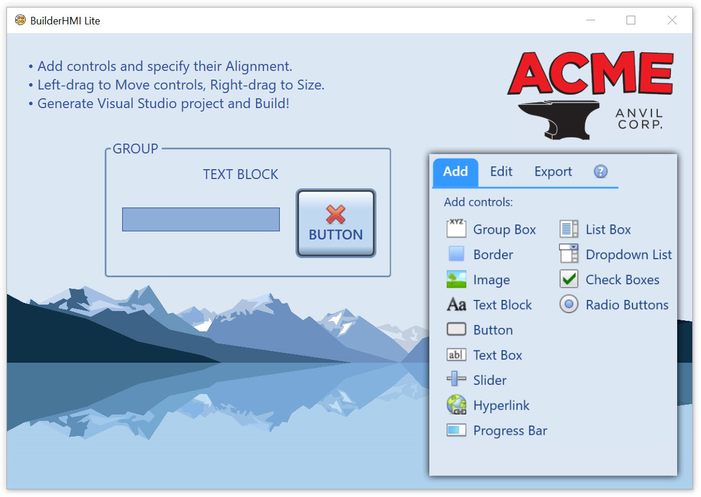

### BuilderHMI.Lite - Simple Drag-and-Drop WPF Layout

WPF design as quick and intuitive as WinForms!
Add controls and specify their alignment. Left-drag to move and right-drag to size.
Generate a complete WPF/C# Visual Studio project, build and run!
Add your own MVVM bindings, event handlers, etc to complete the app.

*.NET Core and .NET Framework!*

**Visual Studio Compatibility:** The .NET Framework (non-Core) project is compatible with both Visual Studio 2019 and VS 2017 and uses .NET 4.6.1. The Core project can only be opened and built using VS 2019 with the ".NET Desktop Development" workload installed.

### CodeProject Article
https://www.codeproject.com/Articles/5283954/BuilderHMI-Lite-Simple-Drag-and-Drop-WPF-Layout

### YouTube Videos
Pet Project: https://youtu.be/4pHF73r7CjA  
Introduction: https://youtu.be/xgmCmU76PFQ

### Features
- Support for the majority of the common WPF control types
- Add controls then Left-drag to Move and Right-drag to Size
- Left/Right/Center/Stretch horizontal alignment and Top/Bottom/Center/Stretch vertical
- Editing functions: Cut/Copy/Paste/Delete, ToFront and ToBack
- WPF Style support for the main window and all controls
- Visual Studio WPF/C# project generation from a template
- Both .NET Core and .NET Framework versions of the app
- Both apps can generate .NET Core and .NET Framework VS projects